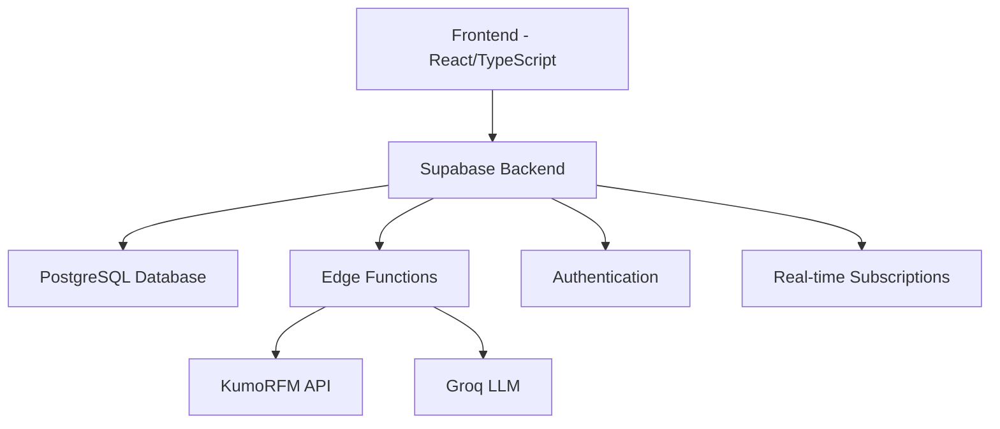

# Hyperelational AI

<div align="center">


**The AI-Powered Relational BI Dashboard for Modern Creatives & Retailers**

*Uncover hidden connections in your data with a foundation model built for relational intelligence.*

[Demo](https://hyperelational.com) • [Documentation](#documentation) • [API Reference](#api-reference) • [Contributing](#contributing)

</div>

---

## Overview

Hyperelational is a next-generation Business Intelligence platform that goes beyond traditional dashboards. Powered by **KumoRFM**, our proprietary relational foundation model, it analyzes deep, complex relationships within your data to provide predictive insights that were previously impossible to surface.

This isn't just about visualizing numbers—it's about understanding the intricate web of connections that drive your business. Whether you're in fashion e-commerce or the music & creative industry, Hyperelational offers a tailored experience to help you make smarter, data-driven decisions.

## ✨ Key Features

### 🤖 AI-Native Analytics
- **Natural Language Queries**: Converse with your data using plain English
- **Predictive Query Language (PQL)**: AI-generated queries with confidence scores
- **Agent-Based Workflows**: Deploy autonomous AI agents for complex business tasks

### 🔮 Advanced Intelligence
- **Predictive Analytics**: Forecast customer churn, sales trends, and market opportunities
- **3D Relational Graph Explorer**: Visualize complex data relationships in an interactive universe
- **Dynamic Audience Builder**: Create hyper-specific segments using AI predictions

### 🌐 Industry-Focused Solutions
- **Fashion E-commerce**: Customer LTV, churn prediction, trend forecasting
- **Music & Creative**: Fan engagement analysis, tour planning, merchandise insights

### 🔌 Seamless Integrations
One-click connections to your favorite platforms:
- Shopify, WooCommerce, Magento
- Google Analytics, Facebook Ads
- Stripe, PayPal
- Spotify for Artists, Bandcamp

## 🏗️ Architecture



**Technology Stack:**
- **Frontend**: React 18.3, TypeScript 5.8, Vite 5.4
- **UI**: shadcn/ui, Tailwind CSS, Framer Motion
- **Visualization**: Recharts, Three.js for 3D graphs
- **Backend**: Supabase (PostgreSQL, Edge Functions)
- **AI Models**: KumoRFM (Relational AI), Groq (LLM inference)

## 🚀 Quick Start

### Prerequisites

- Node.js 18+ 
- Bun (recommended package manager)
- Git
- Supabase CLI
- Docker (for local Supabase services)

### Installation

1. **Clone and Install**
   ```bash
   git clone https://github.com/your-org/hyperelational.git
   cd hyperelational
   bun install
   ```

2. **Setup Local Supabase**
   ```bash
   # Initialize Supabase
   supabase init
   
   # Start local services (Docker required)
   supabase start
   
   # Apply database migrations
   supabase db reset
   
   # Deploy edge functions
   supabase functions deploy
   ```

3. **Configure Environment**
   ```bash
   cp .env.example .env.local
   ```
   
   Update `.env.local` with your configuration:
   ```env
   # Supabase (get from: supabase status)
   VITE_SUPABASE_URL=http://127.0.0.1:54321
   VITE_SUPABASE_ANON_KEY=your-local-anon-key
   SUPABASE_SERVICE_ROLE_KEY=your-local-service-role-key
   
   # AI Services
   KUMO_API_KEY=your-kumo-api-key
   GROQ_API_KEY=your-groq-api-key
   ```

4. **Start Development Server**
   ```bash
   bun run dev
   ```
   
   Navigate to `http://localhost:8080`

## 📁 Project Structure

```
hyperelational/
├── public/                     # Static assets
├── supabase/
│   ├── functions/             # Edge Functions (Deno)
│   │   ├── agent-workflow-executor
│   │   ├── retail-predict-churn
│   │   ├── artist-fan-engagement
│   │   └── sample-data-seeder
│   └── migrations/            # Database schemas
└── src/
    ├── components/
    │   ├── ui/               # shadcn/ui components
    │   ├── analytics/        # Analytics modules
    │   └── dashboard/        # Dashboard widgets
    ├── contexts/             # React contexts
    ├── hooks/               # Custom hooks
    ├── integrations/        # Supabase client
    ├── lib/                # Utilities
    ├── pages/              # Route components
    ├── services/           # Business logic
    └── stores/             # Zustand state
```

## 🔧 Core Edge Functions

Our serverless backend handles complex AI operations through specialized Edge Functions:

| Function | Purpose | Input | Output |
|----------|---------|-------|--------|
| `agent-workflow-executor` | Orchestrates multi-agent workflows | Task config | Execution results |
| `retail-predict-churn` | Customer churn prediction | Customer data | Churn probability |
| `artist-fan-engagement` | Fan engagement scoring | Fan activity | Engagement metrics |
| `artist-forecast-demand` | Tour demand forecasting | Historical data | Demand predictions |
| `retail-recommend-products` | Product recommendations | User profile | Recommended items |

## 🎯 Industry Solutions

### Fashion E-Commerce
```javascript
// Predict customer churn
const churnPrediction = await supabase.functions.invoke('retail-predict-churn', {
  body: { customer_id: 'cust_123' }
})

// Get product recommendations
const recommendations = await supabase.functions.invoke('retail-recommend-products', {
  body: { user_profile: customerData }
})
```

### Music & Creative Industry
```javascript
// Analyze fan engagement
const fanMetrics = await supabase.functions.invoke('artist-fan-engagement', {
  body: { artist_id: 'artist_456', time_window: '30d' }
})

// Forecast tour demand
const demandForecast = await supabase.functions.invoke('artist-forecast-demand', {
  body: { venue_data: venues, historical_sales: sales }
})
```

## 🧪 Testing

```bash
# Run all tests
bun test

# Run with coverage
bun test --coverage

# Run specific test suite
bun test --grep "Edge Functions"

# Test edge functions locally
supabase functions serve
```

## 🚀 Deployment

### Production Deployment

1. **Setup Supabase Project**
   ```bash
   supabase link --project-ref your-project-ref
   supabase db push
   supabase functions deploy
   ```

2. **Deploy Frontend**
   ```bash
   # Build for production
   bun run build
   
   # Deploy to your preferred platform
   # (Vercel, Netlify, etc.)
   ```

3. **Environment Variables**
   ```env
   VITE_SUPABASE_URL=https://your-project.supabase.co
   VITE_SUPABASE_ANON_KEY=your-production-anon-key
   SUPABASE_SERVICE_ROLE_KEY=your-production-service-key
   KUMO_API_KEY=your-production-kumo-key
   GROQ_API_KEY=your-production-groq-key
   ```

## 📖 Documentation

- [API Reference](docs/api-reference.md)
- [Edge Functions Guide](docs/edge-functions.md)
- [Integration Examples](docs/integrations.md)
- [Deployment Guide](docs/deployment.md)
- [Contributing Guidelines](CONTRIBUTING.md)

## 🤝 Contributing

We welcome contributions! Please see our [Contributing Guidelines](CONTRIBUTING.md) for details.

### Development Workflow

1. Fork the repository
2. Create a feature branch (`git checkout -b feature/amazing-feature`)
3. Make your changes
4. Add tests for new functionality
5. Run the test suite (`bun test`)
6. Commit using conventional commits (`git commit -m 'feat: add amazing feature'`)
7. Push to your branch (`git push origin feature/amazing-feature`)
8. Open a Pull Request

## 📊 Performance & Monitoring

- **Response Times**: < 100ms for cached queries, < 2s for AI predictions
- **Uptime**: 99.9% SLA with automatic failover
- **Monitoring**: Built-in error tracking and performance analytics
- **Scaling**: Auto-scaling edge functions handle 10k+ concurrent requests

## 🔐 Security & Privacy

- **Data Encryption**: End-to-end encryption for all data in transit and at rest
- **API Security**: Rate limiting, authentication, and request validation
- **Privacy Compliance**: GDPR, CCPA compliant data handling
- **Audit Logs**: Complete audit trail for all data operations

## 📈 Roadmap

- [ ] **Q1 2025**: Real-time streaming analytics
- [ ] **Q2 2025**: Mobile app (React Native)  
- [ ] **Q3 2025**: Advanced ML model marketplace
- [ ] **Q4 2025**: Multi-tenant enterprise features

## 🙏 Acknowledgments

- **[Supabase](https://supabase.com)**: For their incredible open-source backend platform
- **[Kumo.AI](https://kumo.ai)**: For the groundbreaking Relational Foundation Model
- **[Groq](https://groq.com)**: For high-speed LLM inference powering our AI chat
- **[shadcn/ui](https://ui.shadcn.com)**: For the beautiful, accessible component library

## 📄 License

This project is licensed under the MIT License - see the [LICENSE](LICENSE) file for details.

---

<div align="center">
  <strong>Ready to unlock the power of relational intelligence?</strong><br>
  <a href="https://hyperelational.com">Get Started Today</a> • <a href="mailto:hello@hyperelational.com">Contact Us</a>
</div>
